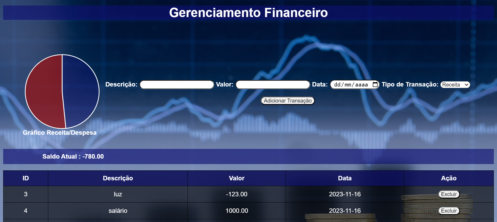

# Projeto-Front-e-backend
Projeto final 3000 talentos

O projeto foi efetuado com o intuito de ajudar no gerenciamento financeiro individual, adicionando suas despesas e receitas, criando assim seu fluxo de caixa pessoal.

Projeto utilizando html, css, javascript com os pacotes nodemon e express e o uso do banco de dados SQlite.

Para instalar as dependências dos pacotes do node do projeto, digite o "npm start".

Prévia do html gerado pelo projeto.

